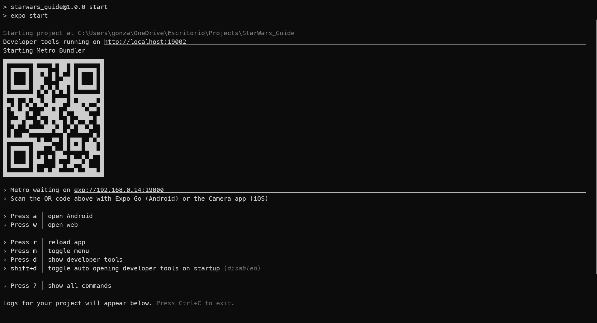
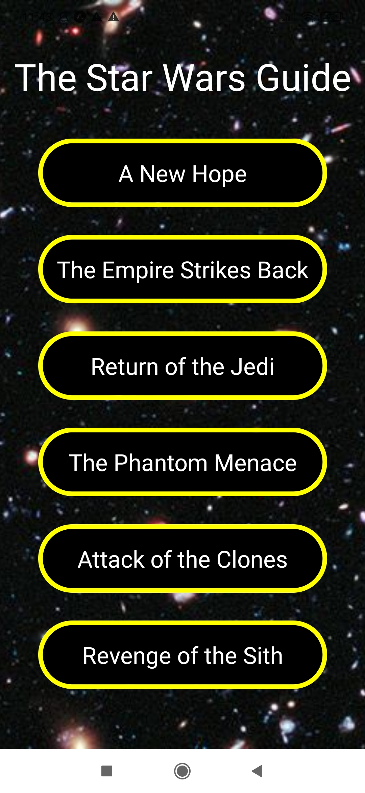
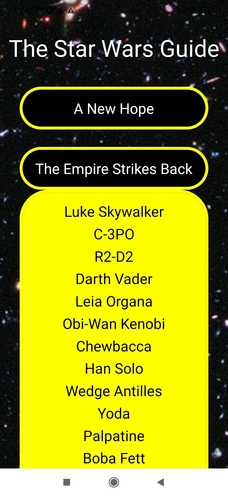
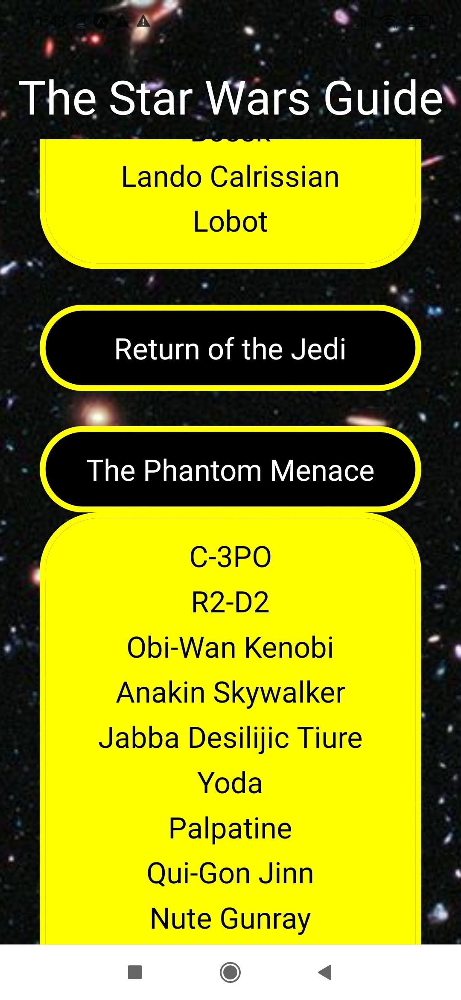

# StarWars-Guide
Star Wars guide based on React Native, the SWAPI, and Expo

## Overview
Have you ever been with your friends and all of the sudden you could not remember if a character appeared or not in a Star Wars film? This is your app!

The Star Wars Guide is a React Native app with a simple aim: just hit on one othe the film titles and the complete list of characters will appear right bellow.

## Installation
Once you have copied the repository into your local machine and you are located inside the root directory of the project, run the next command in your terminal:
```
npm run start
```
Expo will take control of the process and build the project on a local port. It will also display a QR code for you to scan with the Expo app or with your favourite mobile simulator. Your terminal should display something like this:

</a>

Once opened in you mobile device or simulator, you can start pressing any of the films and a complete list of characters should display beneath.

</a>
</a>
</a>


## Tech Stack
* React Native
* Expo.dev
* Axios


## Author
Gonzalo García Arahuetes
- 💼 [Linkedin](https://www.linkedin.com/in/gonzalo-garcia-arahuetes/)
- 📫 gonzaloarahuetes@gmail.com

## Motivation
This app has been made for the friends of [Gataca](https://gataca.io)
